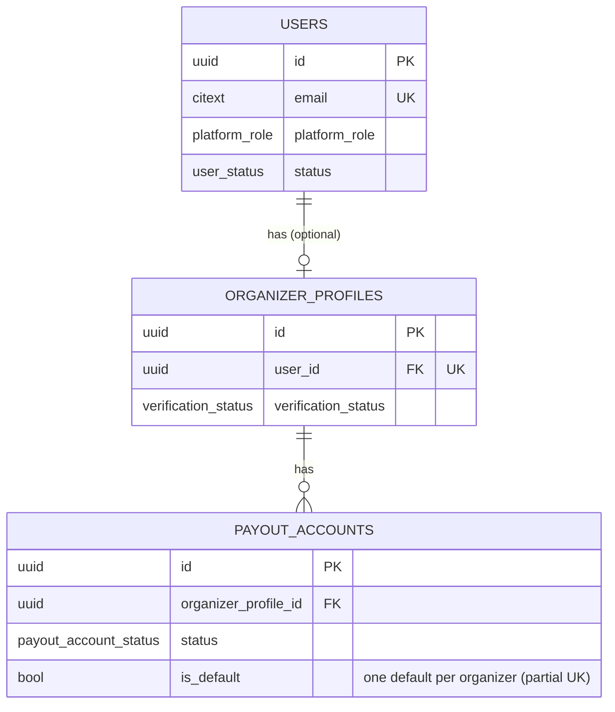
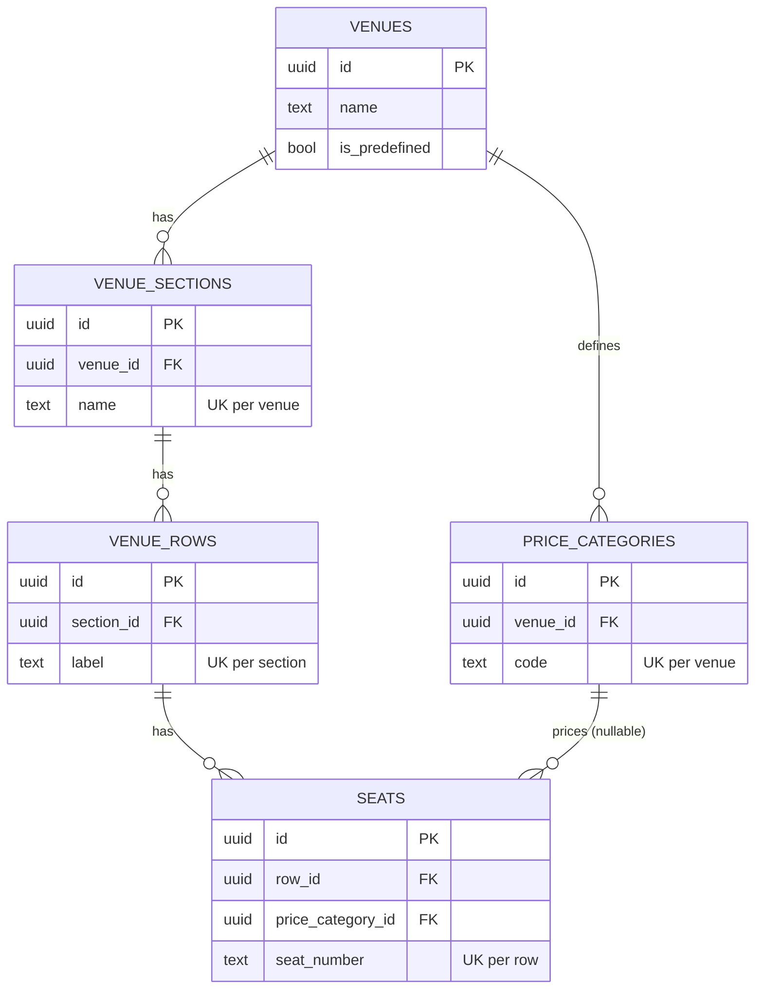
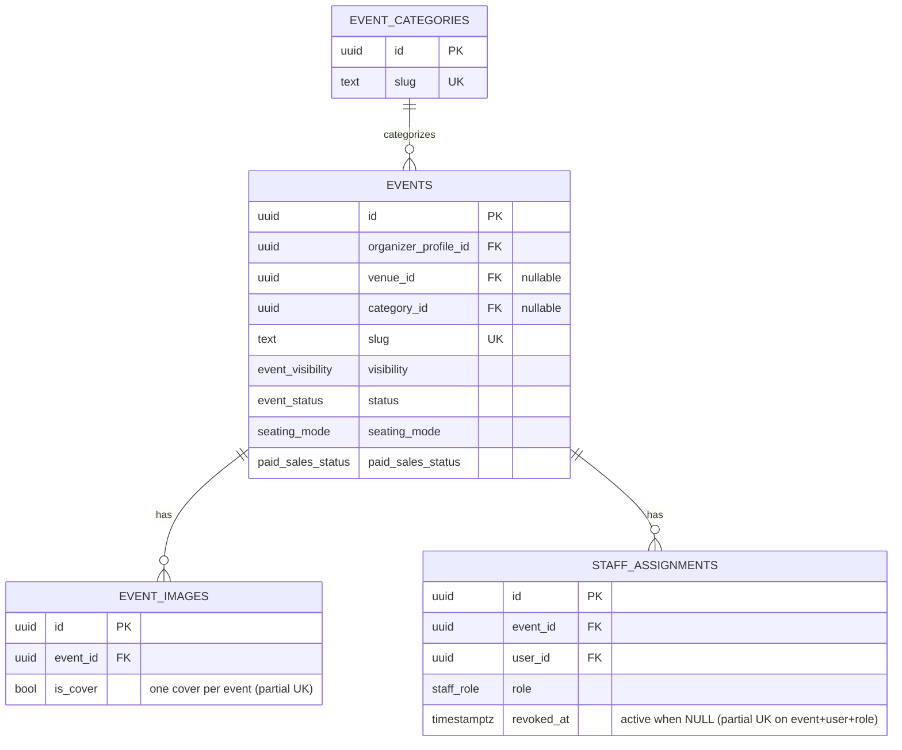
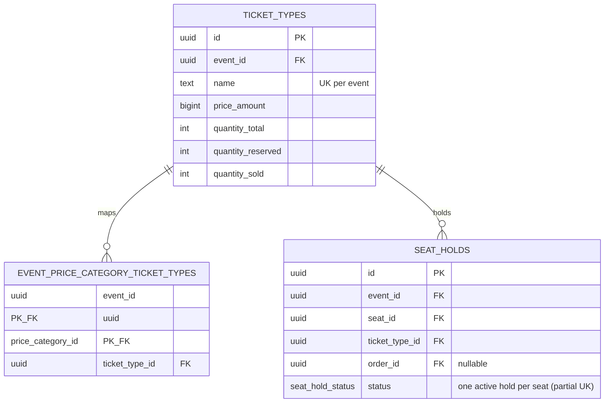
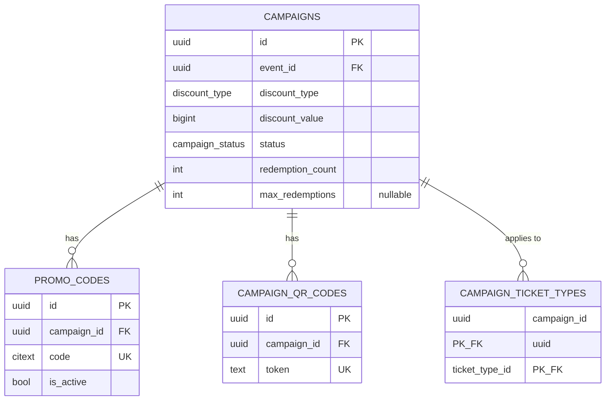
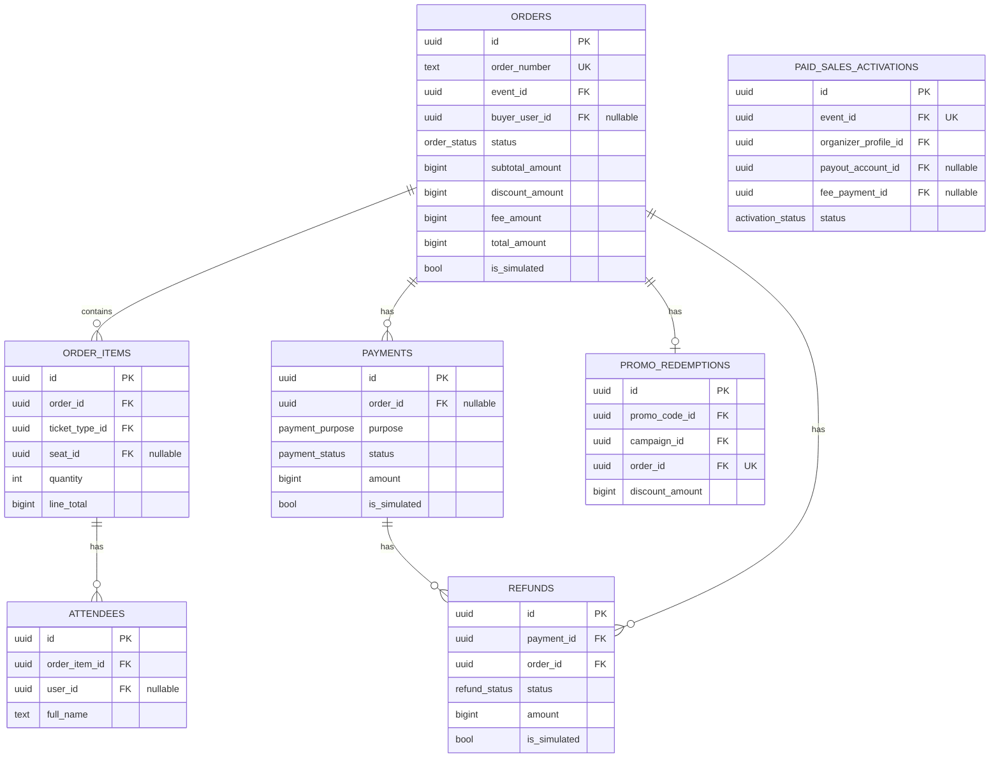
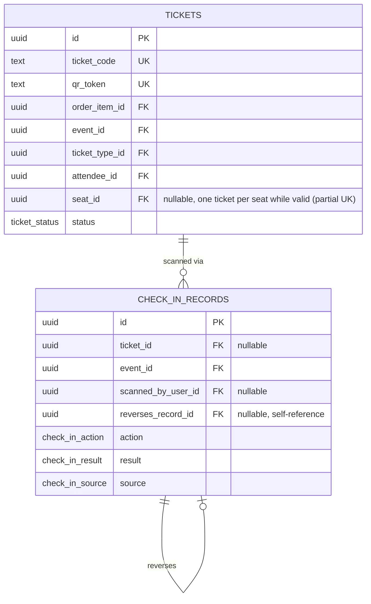
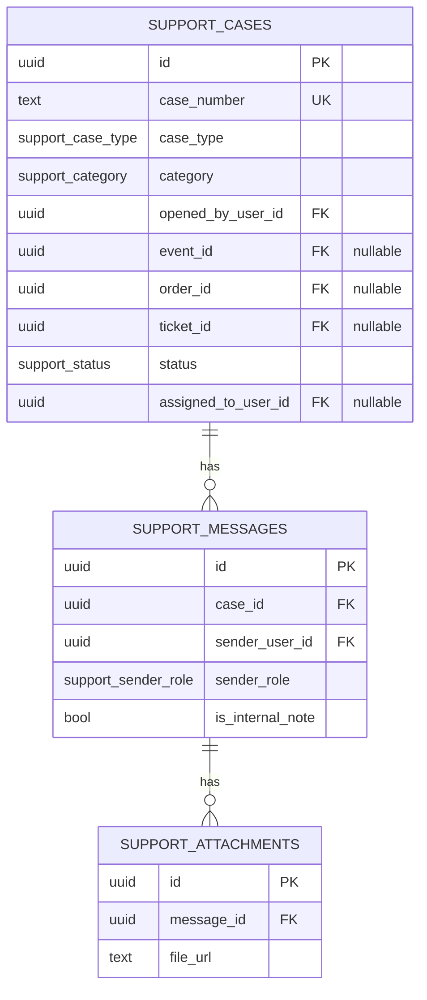
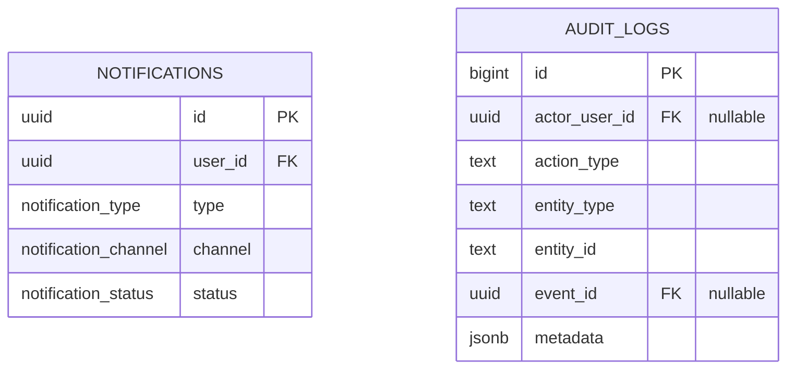
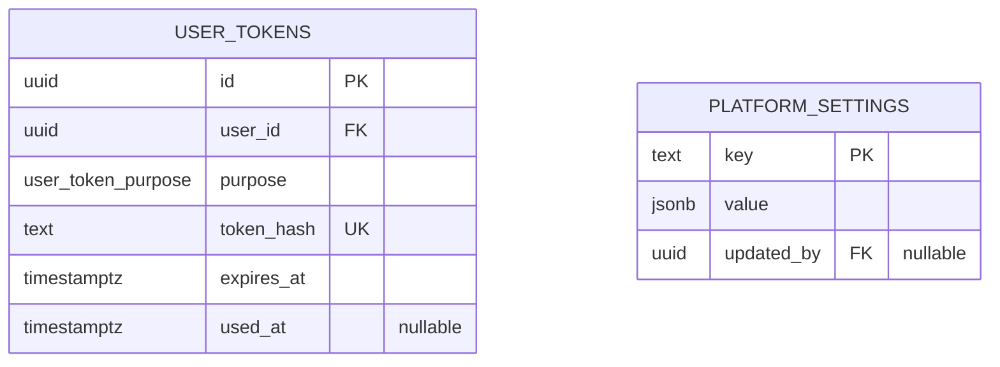

# BiletFlow — Entity Relationship Diagram

Hand-authored from `backend/migrations/0001_init_schema.up.sql` and
`0002_platform_support.up.sql`. Update this file whenever a migration adds,
removes or changes a table or relationship. Diagrams are grouped by the same
numbered sections used in the migration files; only relationships *within*
each section are drawn — FKs that cross section boundaries are listed once in
the "Cross-section references" table at the end instead of one unreadable
35-table diagram.

## 1. Identity and access

## 2. Venues and seating

## 3. Events

## 4. Ticket inventory and seat holds

## 5. Promotions

## 6. Orders, attendees, payments

## 7. Tickets and check-in

## 8. Support

## 9. Notifications and audit

`audit_logs` is append-only (a `BEFORE UPDATE OR DELETE` trigger blocks
mutation); no other section-9 relationships exist beyond the FKs listed
below.

## 10. Platform support (0002)

Seeded `platform_settings` rows: `activation_fee_kzt`, `processing_fee_percent`,
`order_hold_minutes`, `seat_hold_minutes`.

## Cross-section references

FKs that cross the section boundaries above:

| Column | References |
|---|---|
| `organizer_profiles.user_id` | `users.id` |
| `payout_accounts.organizer_profile_id` | `organizer_profiles.id` |
| `venues.created_by` | `users.id` |
| `events.organizer_profile_id` | `organizer_profiles.id` |
| `events.venue_id` | `venues.id` |
| `events.category_id` | `event_categories.id` |
| `staff_assignments.user_id` / `assigned_by` | `users.id` |
| `ticket_types.event_id` | `events.id` |
| `event_price_category_ticket_types.price_category_id` | `price_categories.id` |
| `event_price_category_ticket_types.event_id` | `events.id` |
| `seat_holds.event_id` | `events.id` |
| `seat_holds.seat_id` | `seats.id` |
| `seat_holds.held_by_user_id` | `users.id` |
| `seat_holds.order_id` | `orders.id` (added after `orders` exists) |
| `campaigns.event_id` | `events.id` |
| `campaigns.created_by` | `users.id` |
| `campaign_ticket_types.ticket_type_id` | `ticket_types.id` |
| `orders.event_id` | `events.id` |
| `orders.buyer_user_id` | `users.id` |
| `orders.promo_code_id` | `promo_codes.id` |
| `orders.campaign_id` | `campaigns.id` |
| `order_items.ticket_type_id` | `ticket_types.id` |
| `order_items.seat_id` | `seats.id` |
| `attendees.user_id` | `users.id` |
| `paid_sales_activations.event_id` | `events.id` |
| `paid_sales_activations.organizer_profile_id` | `organizer_profiles.id` |
| `paid_sales_activations.payout_account_id` | `payout_accounts.id` |
| `paid_sales_activations.fee_payment_id` | `payments.id` |
| `tickets.order_item_id` | `order_items.id` |
| `tickets.event_id` | `events.id` |
| `tickets.ticket_type_id` | `ticket_types.id` |
| `tickets.attendee_id` | `attendees.id` |
| `tickets.seat_id` | `seats.id` |
| `check_in_records.event_id` | `events.id` |
| `check_in_records.ticket_id` | `tickets.id` |
| `check_in_records.scanned_by_user_id` | `users.id` |
| `support_cases.opened_by_user_id` / `assigned_to_user_id` | `users.id` |
| `support_cases.event_id` / `order_id` / `ticket_id` | `events.id` / `orders.id` / `tickets.id` |
| `support_messages.sender_user_id` | `users.id` |
| `notifications.user_id` | `users.id` |
| `audit_logs.actor_user_id` | `users.id` |
| `audit_logs.event_id` | `events.id` |
| `user_tokens.user_id` | `users.id` |
| `platform_settings.updated_by` | `users.id` |
